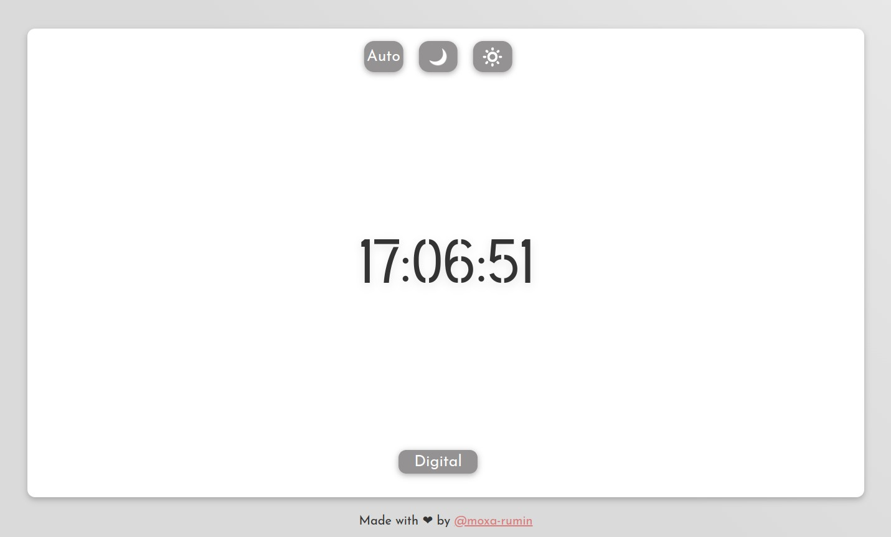
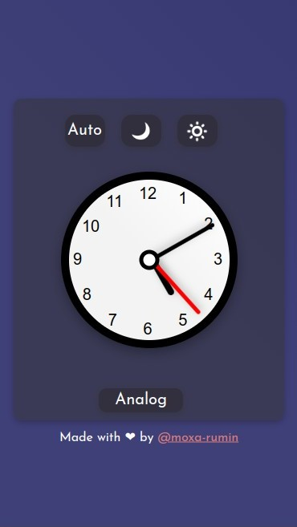
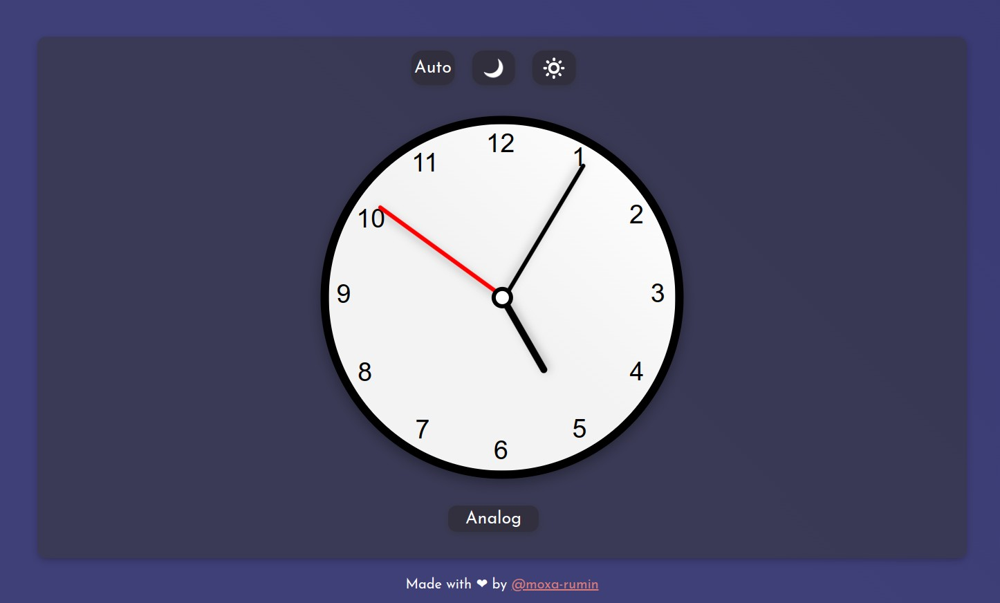
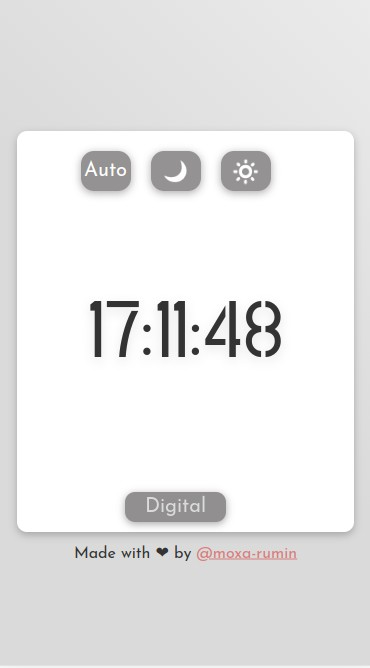

# Web clock 
Web clock is a website showing the time in analog and digital form. 
      
The theme of the design changes dynamically depending on the time of day, but there is also an option to enable one of the two modes permanently. 
    
This site is a learning project.
